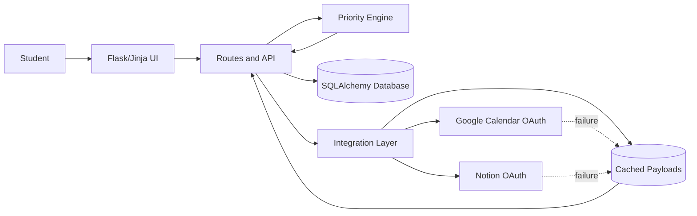

# Architecture

## Design decisions

- **Explainable ranking:** scoring is deterministic and isolated in `services/priority.py`, so each recommendation can show its factors.
- **Resilient integrations:** providers share a cached fallback contract. The production build should add token encryption, exponential backoff, and background sync.
- **Thin routes:** routes coordinate; models store; services decide; integrations communicate externally.
- **Safe prototype:** API credentials are environment variables and `.env` is ignored.

